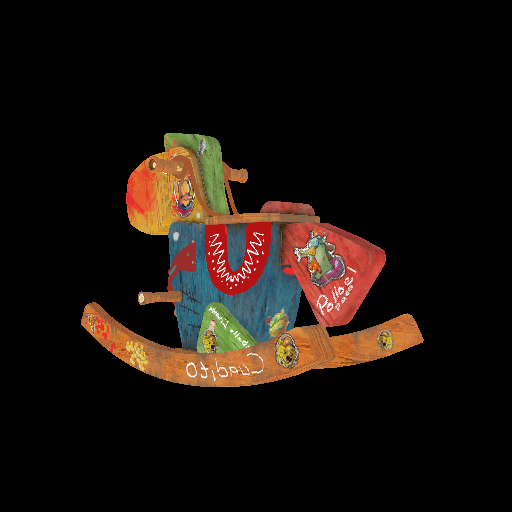
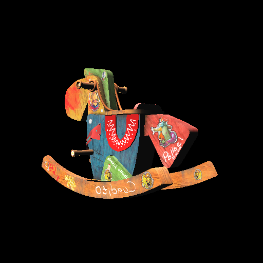
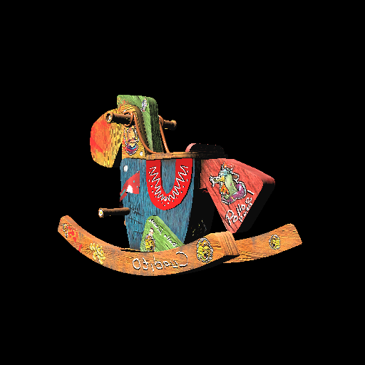
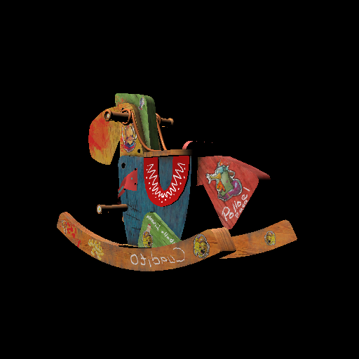

# Small Raterizer

## Features
- Back face culling
- Perspective correct interpolation
- Normal mapping
- Texture mapping
- Blinn-Phong mapping
- Bump mapping
- Physically based rendering


## Running
```
mkdir build
cd build
cmake -G "MinGW Makefiles" .. (first time) / cmake ..
make
./smallRasterizer
```

## Results
<center></center>
<center><p>Texture mapping</p></center>

<center></center>
<center><p>Blinn-Phong mapping</p></center>

<center></center>
<center><p>Bump mapping</p></center>

<center></center>
<center><p>PBR</p></center>


## Acknowledgement
The code is based on *[GAMES101](https://sites.cs.ucsb.edu/~lingqi/teaching/games101.html)*, *[GAMES202](https://sites.cs.ucsb.edu/~lingqi/teaching/games202.html)* and *[Tiny Renderer](https://github.com/ssloy/tinyrenderer)*.